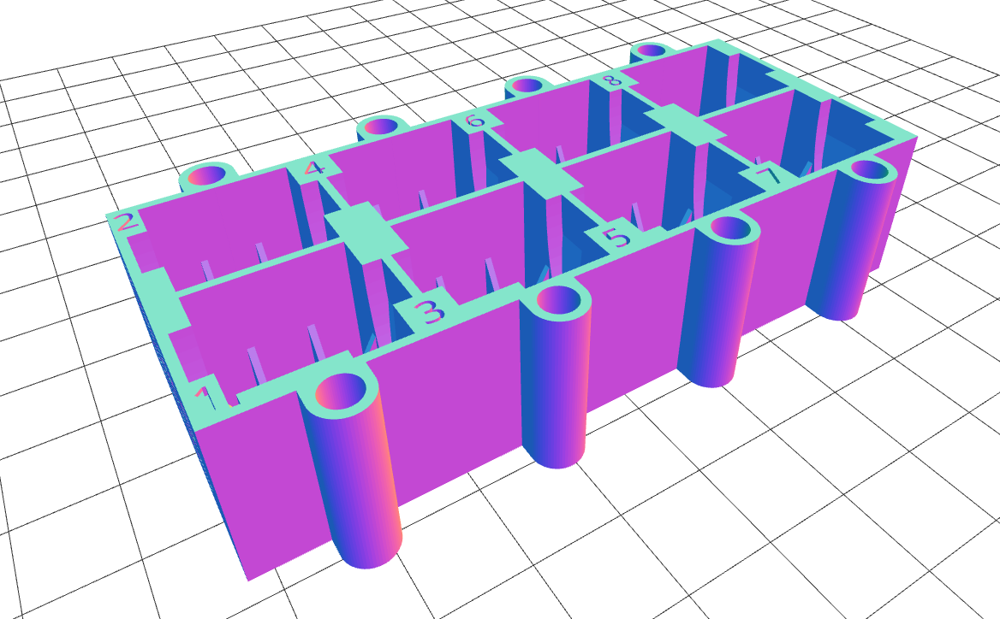
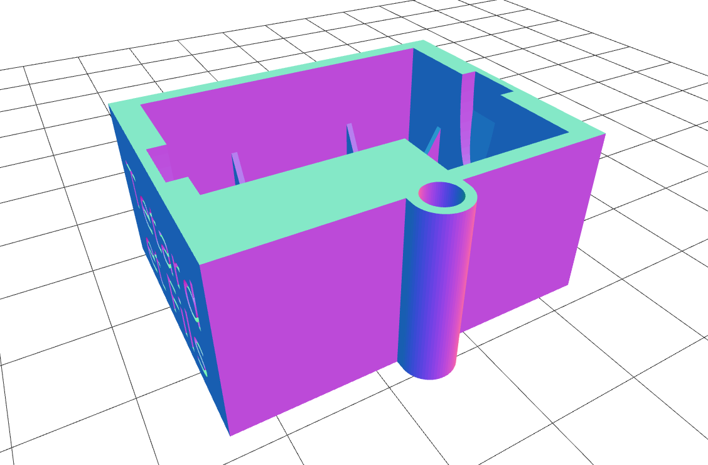
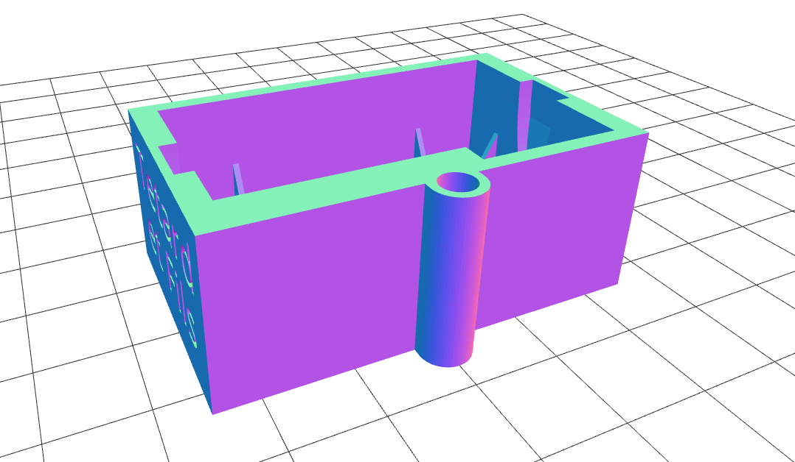
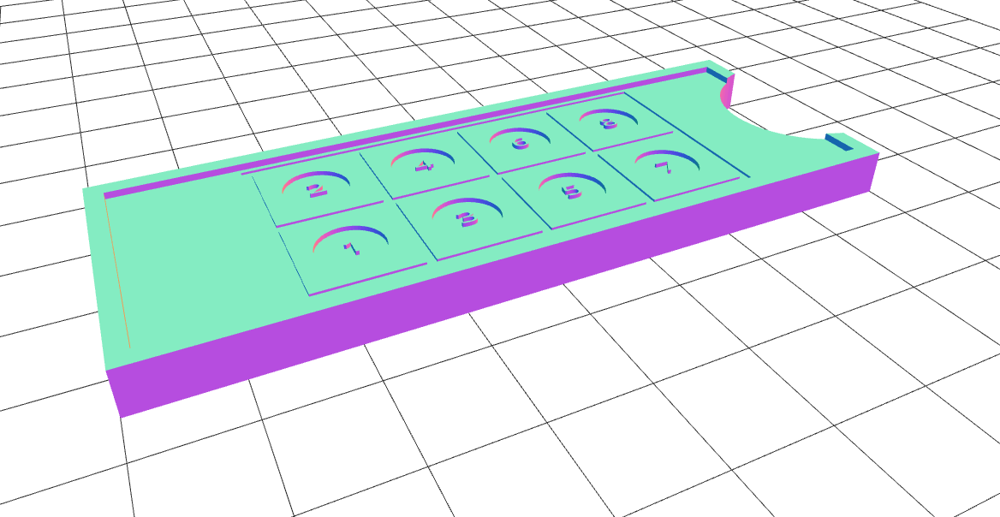
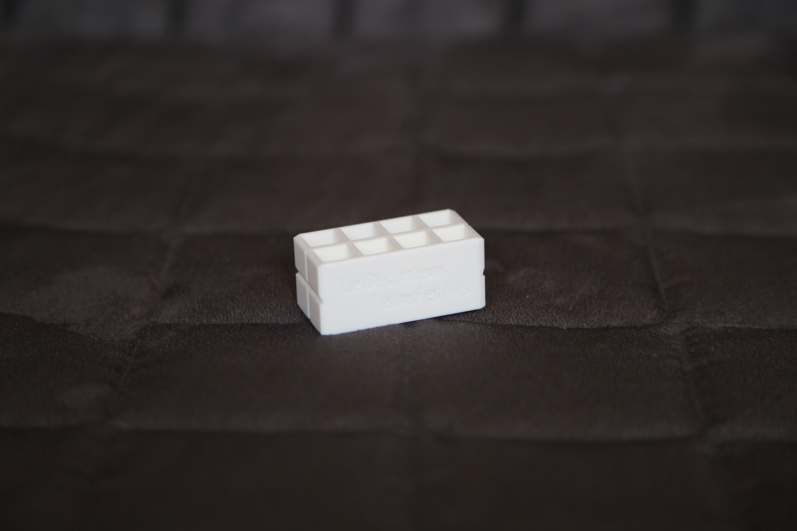

Please, visit https://micropalprinter.wordpress.com to see our products!

# Decanter

## New 12 x 12 mm x 8 tanks Decanter and slide guide
The DecanteurRad12x12x8.stl and Slide_guide.stl files are introduced in the "A new automated radiolarian image acquisition, stacking, processing, segmentation, and identification workflow" publication.

This 3D printable decanter was designed for random settling of particles (coccoliths, radiolarians, benthic foraminiferal fragments…) on 8 standard 12 x 12 mm microscope cover slides.

Up to 3.5 ml of solution containing the particles you want to randomly settle on your cover slides can be dropped into each well.

Click on the image above to see the instruction video.

## New 32 x 24 mm x 1 tank Decanter
The DecanteurRad32x24x1.stl file is introduced in the "A new automated radiolarian image acquisition, stacking, processing, segmentation, and identification workflow" publication.

This 3D printable decanter was designed for random settling of particles (coccoliths, radiolarians, benthic foraminiferal fragments…) on 1 standard 32 x 24 mm microscope cover slide.

## New 40 x 22 mm x 1 tank Decanter
The DecanteurRad40x22x1.stl file is introduced in the "A new automated radiolarian image acquisition, stacking, processing, segmentation, and identification workflow" publication.

This 3D printable decanter was designed for random settling of particles (coccoliths, radiolarians, benthic foraminiferal fragments…) on 1 standard 40 x 22 mm microscope cover slide.

## New Slide Guide
The Slide_guide.stl file is introduced in the "A new automated radiolarian image acquisition, stacking, processing, segmentation, and identification workflow" publication.

This 3D printable slide guide was designed for preparation of microscopic slide using standard 12 x 12 mm microscope cover slides on a 76 x 28 mm glass slide.

## Original decanter
The Original_decantor_stl file is a 3D printable version of the model presented in:
https://www.sciencedirect.com/science/article/abs/pii/S0377839817300221

This 3D printable decanter was designed for random settling of particles (coccoliths, radiolarians, benthic foraminiferal fragments…) on a standard 78 x 26 mm microscope glass slide.

Up to 2 ml of solution containing the particles you want to randomly settle on your slide can be dropped into each well.

# ! Custom-sized decanters can also be designed on demand !
You can contact us at: tetard.martin@gmail.com
Please, visit https://micropalprinter.wordpress.com to see our products!
