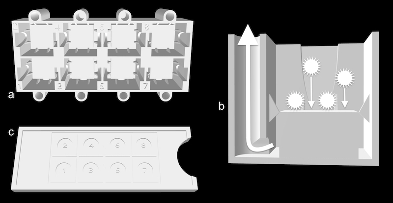

# Decanter

## New Decanter and slide guide
The New_decanter.stl and Slide_guide.stl files are introduced in the "A new automated radiolarian image acquisition, stacking, processing, segmentation, and identification workflow" publication.

This 3D printable decanter was designed for random settling of particles (coccoliths, radiolarians, benthic foraminiferal fragments…) on 8 standard 12 x 12 mm microscope cover slides.

Up to 3.5 ml of solution containing the particles you want to randomly settle on your cover slides can be dropped into each well.

Click on the image above to see the instruction video.

## Original decanter
The Original_decantor_stl file is a 3D printable version of the model presented in:
https://www.sciencedirect.com/science/article/abs/pii/S0377839817300221

This 3D printable decanter was designed for random settling of particles (coccoliths, radiolarians, benthic foraminiferal fragments…) on a standard 78 x 26 mm microscope glass slide.

Up to 2 ml of solution containing the particles you want to randomly settle on your slide can be dropped into each well.

