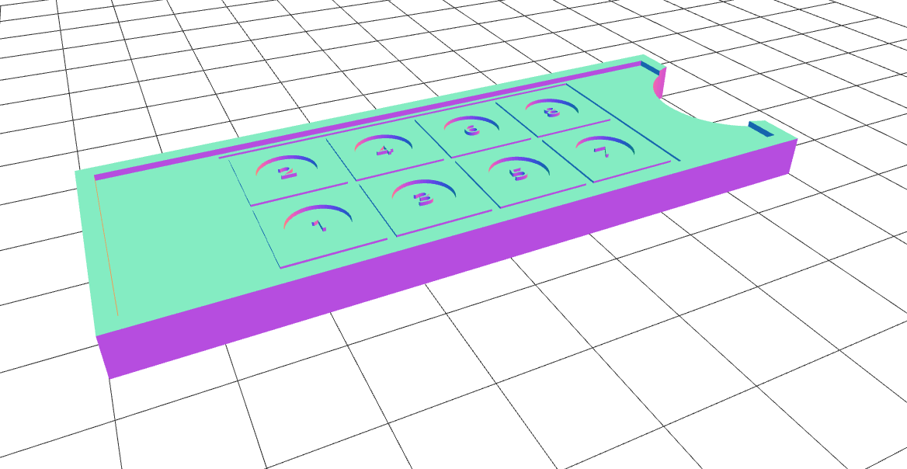

## UPDATE: If you don't own a 3D printer, decanter and slide guide can be printed on demand.
You can contact us at tetard.martin@gmail.com for more information and visit https://micropalprinter.wordpress.com to see our products!

# Decanter

## New 12 x 12 mm x 8 tanks Decanter and slide guide
The DecanteurRad12x12x8.stl and Slide_guide.stl files are introduced in the "A new automated radiolarian image acquisition, stacking, processing, segmentation, and identification workflow" publication.

This 3D printable decanter was designed for random settling of particles (coccoliths, radiolarians, benthic foraminiferal fragments…) on 8 standard 12 x 12 mm microscope cover slides.

Up to 3.5 ml of solution containing the particles you want to randomly settle on your cover slides can be dropped into each well.

Click on the image above to see the instruction video.

## New Slide Guide
The Slide_guide.stl file is introduced in the "A new automated radiolarian image acquisition, stacking, processing, segmentation, and identification workflow" publication.

This 3D printable slide guide was designed for preparation of microscopic slide using standard 12 x 12 mm microscope cover slides on a 76 x 28 mm glass slide.

# ! Custom-sized decanters can also be designed on demand !
You can contact us at: tetard.martin@gmail.com

## UPDATE: If you don't own a 3D printer, decanter and slide guide can be printed on demand.
You can contact us at tetard.martin@gmail.com for more information and visit https://micropalprinter.wordpress.com to see our products!
